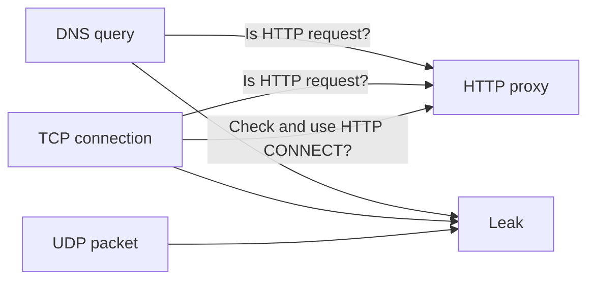
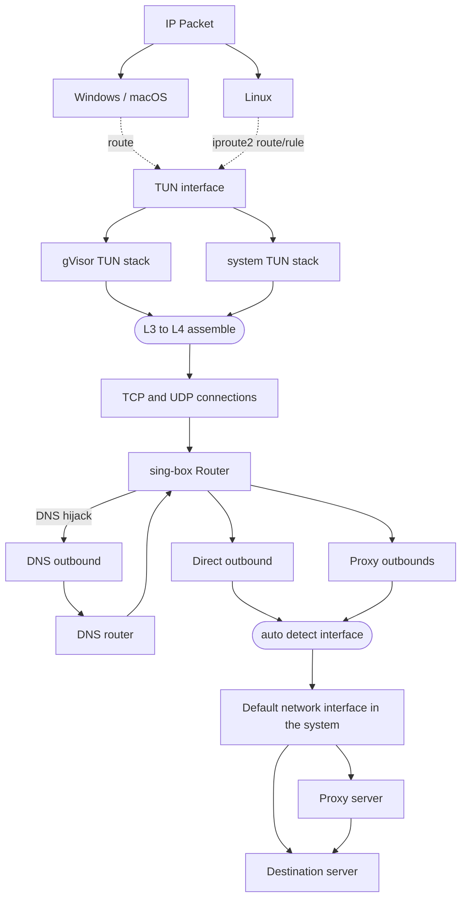

# 客户端

## 引言

长期以来，图形操作系统代理客户端的现代用法和原理一直没有得到明确的描述。不过，我们可以将其分为三种类型：系统代理、防火墙重定向和虚拟接口。

## 系统代理

几乎所有图形环境都支持系统级代理，它们本质上是只支持 TCP 的普通 HTTP 代理。

| 操作系统/桌面环境                       |            系统代理            |    应用程序支持    |
| :-------------------------------------- | :----------------------------: | :----------------: |
| Windows                                 |       :white_check_mark:       | :white_check_mark: |
| macOS                                   |       :white_check_mark:       | :white_check_mark: |
| GNOME/KDE                               |       :white_check_mark:       | :white_check_mark: |
| Android                                 |       需要 ROOT/ADB 权限       | :white_check_mark: |
| Android/iOS（使用 sing-box 图形客户端） | 通过 `tun.platform.http_proxy` | :white_check_mark: |

作为最著名的代理方法之一，它有许多缺点：许多不基于 HTTP 的 TCP 客户端不会检查和使用系统代理。此外，UDP 和 ICMP 流量也会绕过代理。



## 防火墙重定向

这种使用方式通常依赖于操作系统提供的防火墙或 hook 接口，如 Windows 的 WFP、Linux 的 redirect/TProxy/eBPF 以及 macOS 的 pf。
虽然这种方法具有侵入性，配置起来也很麻烦，但由于对软件的技术要求不高，它在 V2Ray 等业余代理开源项目社区中仍然很受欢迎。

## 虚拟接口

所有 L2/L3 代理（严格定义的 VPN，如 OpenVPN、WireGuard）都基于虚拟网络接口，这也是所有 L4 代理作为 VPN 在 Android、iOS 等移动平台上运行的唯一方式。

sing-box 继承并发展了 clash-premium 的 TUN 入站（L3 到 L4 转换），作为执行透明代理的最合理方法。



## 示例

### TUN 的基本方法

::: tabs

== 仅 IPv4

```json
{
  "dns": {
    "servers": [
      {
        "tag": "google",
        "address": "tls://8.8.8.8"
      },
      {
        "tag": "local",
        "address": "223.5.5.5",
        "detour": "direct"
      }
    ],
    "rules": [
      {
        "outbound": "any",
        "server": "local"
      }
    ],
    "strategy": "ipv4_only"
  },
  "inbounds": [
    {
      "type": "tun",
      "inet4_address": "172.19.0.1/30",
      "auto_route": true,
      "strict_route": false
    }
  ],
  "outbounds": [
    // ...
    {
      "type": "direct",
      "tag": "direct"
    },
    {
      "type": "dns",
      "tag": "dns-out"
    }
  ],
  "route": {
    "rules": [
      {
        "protocol": "dns",
        "outbound": "dns-out"
      },
      {
        "geoip": ["private"],
        "outbound": "direct"
      }
    ],
    "auto_detect_interface": true
  }
}
```

== IPv4 & IPv6

```json
{
  "dns": {
    "servers": [
      {
        "tag": "google",
        "address": "tls://8.8.8.8"
      },
      {
        "tag": "local",
        "address": "223.5.5.5",
        "detour": "direct"
      }
    ],
    "rules": [
      {
        "outbound": "any",
        "server": "local"
      }
    ]
  },
  "inbounds": [
    {
      "type": "tun",
      "inet4_address": "172.19.0.1/30",
      "inet6_address": "fdfe:dcba:9876::1/126",
      "auto_route": true,
      "strict_route": false
    }
  ],
  "outbounds": [
    // ...
    {
      "type": "direct",
      "tag": "direct"
    },
    {
      "type": "dns",
      "tag": "dns-out"
    }
  ],
  "route": {
    "rules": [
      {
        "protocol": "dns",
        "outbound": "dns-out"
      },
      {
        "geoip": ["private"],
        "outbound": "direct"
      }
    ],
    "auto_detect_interface": true
  }
}
```

== FakeIP

```json
{
  "dns": {
    "servers": [
      {
        "tag": "google",
        "address": "tls://8.8.8.8"
      },
      {
        "tag": "local",
        "address": "223.5.5.5",
        "detour": "direct"
      },
      {
        "tag": "remote",
        "address": "fakeip"
      }
    ],
    "rules": [
      {
        "outbound": "any",
        "server": "local"
      },
      {
        "query_type": ["A", "AAAA"],
        "server": "remote"
      }
    ],
    "fakeip": {
      "enabled": true,
      "inet4_range": "198.18.0.0/15",
      "inet6_range": "fc00::/18"
    },
    "independent_cache": true
  },
  "inbounds": [
    {
      "type": "tun",
      "inet4_address": "172.19.0.1/30",
      "inet6_address": "fdfe:dcba:9876::1/126",
      "auto_route": true,
      "strict_route": true
    }
  ],
  "outbounds": [
    // ...
    {
      "type": "direct",
      "tag": "direct"
    },
    {
      "type": "dns",
      "tag": "dns-out"
    }
  ],
  "route": {
    "rules": [
      {
        "protocol": "dns",
        "outbound": "dns-out"
      },
      {
        "geoip": ["private"],
        "outbound": "direct"
      }
    ],
    "auto_detect_interface": true
  }
}
```

:::

### 分流方案

::: tabs

== DNS 规则

```json
{
  "dns": {
    "servers": [
      {
        "tag": "google",
        "address": "tls://8.8.8.8"
      },
      {
        "tag": "local",
        "address": "223.5.5.5",
        "detour": "direct"
      }
    ],
    "rules": [
      {
        "outbound": "any",
        "server": "local"
      },
      {
        "clash_mode": "Direct",
        "server": "local"
      },
      {
        "clash_mode": "Global",
        "server": "google"
      },
      {
        "rule_set": "geosite-geolocation-cn",
        "server": "local"
      }
    ]
  },
  "route": {
    "rule_set": [
      {
        "type": "remote",
        "tag": "geosite-geolocation-cn",
        "format": "binary",
        "url": "https://raw.githubusercontent.com/SagerNet/sing-geosite/rule-set/geosite-geolocation-cn.srs"
      }
    ]
  }
}
```

== DNS 规则进阶（但更慢，1.9.0+）

::: tabs

=== DNS 泄露

```json
{
  "dns": {
    "servers": [
      {
        "tag": "google",
        "address": "tls://8.8.8.8"
      },
      {
        "tag": "local",
        "address": "https://223.5.5.5/dns-query",
        "detour": "direct"
      }
    ],
    "rules": [
      {
        "outbound": "any",
        "server": "local"
      },
      {
        "clash_mode": "Direct",
        "server": "local"
      },
      {
        "clash_mode": "Global",
        "server": "google"
      },
      {
        "rule_set": "geosite-geolocation-cn",
        "server": "local"
      },
      {
        "clash_mode": "Default",
        "server": "google"
      },
      {
        "type": "logical",
        "mode": "and",
        "rules": [
          {
            "rule_set": "geosite-geolocation-!cn",
            "invert": true
          },
          {
            "rule_set": "geoip-cn"
          }
        ],
        "server": "local"
      }
    ]
  },
  "route": {
    "rule_set": [
      {
        "type": "remote",
        "tag": "geosite-geolocation-cn",
        "format": "binary",
        "url": "https://raw.githubusercontent.com/SagerNet/sing-geosite/rule-set/geosite-geolocation-cn.srs"
      },
      {
        "type": "remote",
        "tag": "geosite-geolocation-!cn",
        "format": "binary",
        "url": "https://raw.githubusercontent.com/SagerNet/sing-geosite/rule-set/geosite-geolocation-!cn.srs"
      },
      {
        "type": "remote",
        "tag": "geoip-cn",
        "format": "binary",
        "url": "https://raw.githubusercontent.com/SagerNet/sing-geoip/rule-set/geoip-cn.srs"
      }
    ]
  },
  "experimental": {
    "cache_file": {
      "enabled": true,
      "store_rdrc": true
    },
    "clash_api": {
      "default_mode": "Enhanced"
    }
  }
}
```

=== DNS 不泄露，但更慢（1.9.0-alpha.2+）

```json
{
  "dns": {
    "servers": [
      {
        "tag": "google",
        "address": "tls://8.8.8.8"
      },
      {
        "tag": "local",
        "address": "https://223.5.5.5/dns-query",
        "detour": "direct"
      }
    ],
    "rules": [
      {
        "outbound": "any",
        "server": "local"
      },
      {
        "clash_mode": "Direct",
        "server": "local"
      },
      {
        "clash_mode": "Global",
        "server": "google"
      },
      {
        "rule_set": "geosite-geolocation-cn",
        "server": "local"
      },
      {
        "type": "logical",
        "mode": "and",
        "rules": [
          {
            "rule_set": "geosite-geolocation-!cn",
            "invert": true
          },
          {
            "rule_set": "geoip-cn"
          }
        ],
        "server": "google",
        "client_subnet": "114.114.114.114/24" // Any China client IP address
      }
    ]
  },
  "route": {
    "rule_set": [
      {
        "type": "remote",
        "tag": "geosite-geolocation-cn",
        "format": "binary",
        "url": "https://raw.githubusercontent.com/SagerNet/sing-geosite/rule-set/geosite-geolocation-cn.srs"
      },
      {
        "type": "remote",
        "tag": "geosite-geolocation-!cn",
        "format": "binary",
        "url": "https://raw.githubusercontent.com/SagerNet/sing-geosite/rule-set/geosite-geolocation-!cn.srs"
      },
      {
        "type": "remote",
        "tag": "geoip-cn",
        "format": "binary",
        "url": "https://raw.githubusercontent.com/SagerNet/sing-geoip/rule-set/geoip-cn.srs"
      }
    ]
  },
  "experimental": {
    "cache_file": {
      "enabled": true,
      "store_rdrc": true
    },
    "clash_api": {
      "default_mode": "Enhanced"
    }
  }
}
```

== 路由规则

```json
{
  "outbounds": [
    {
      "type": "direct",
      "tag": "direct"
    },
    {
      "type": "block",
      "tag": "block"
    }
  ],
  "route": {
    "rules": [
      {
        "type": "logical",
        "mode": "or",
        "rules": [
          {
            "protocol": "dns"
          },
          {
            "port": 53
          }
        ],
        "outbound": "dns"
      },
      {
        "ip_is_private": true,
        "outbound": "direct"
      },
      {
        "clash_mode": "Direct",
        "outbound": "direct"
      },
      {
        "clash_mode": "Global",
        "outbound": "default"
      },
      {
        "type": "logical",
        "mode": "or",
        "rules": [
          {
            "port": 853
          },
          {
            "network": "udp",
            "port": 443
          },
          {
            "protocol": "stun"
          }
        ],
        "outbound": "block"
      },
      {
        "rule_set": ["geoip-cn", "geosite-geolocation-cn"],
        "outbound": "direct"
      }
    ],
    "rule_set": [
      {
        "type": "remote",
        "tag": "geoip-cn",
        "format": "binary",
        "url": "https://raw.githubusercontent.com/SagerNet/sing-geoip/rule-set/geoip-cn.srs"
      },
      {
        "type": "remote",
        "tag": "geosite-geolocation-cn",
        "format": "binary",
        "url": "https://raw.githubusercontent.com/SagerNet/sing-geosite/rule-set/geosite-geolocation-cn.srs"
      }
    ]
  }
}
```

:::
